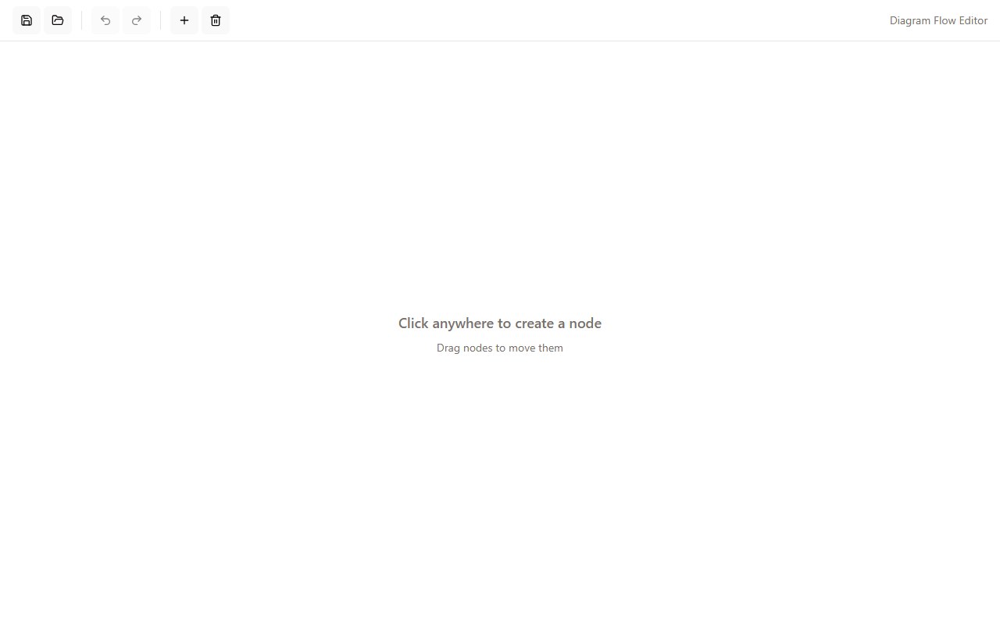
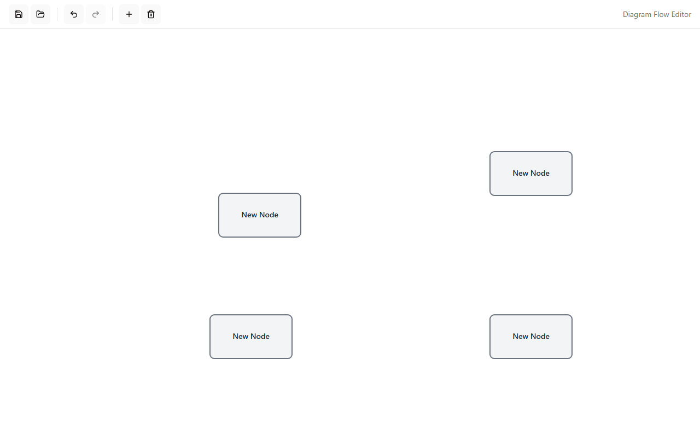
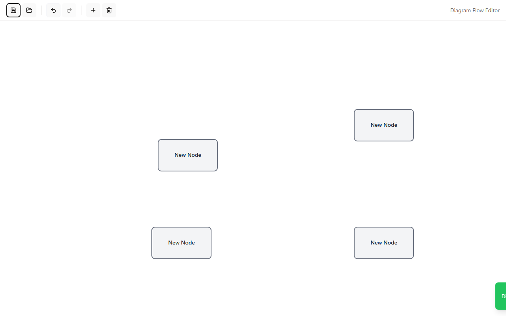
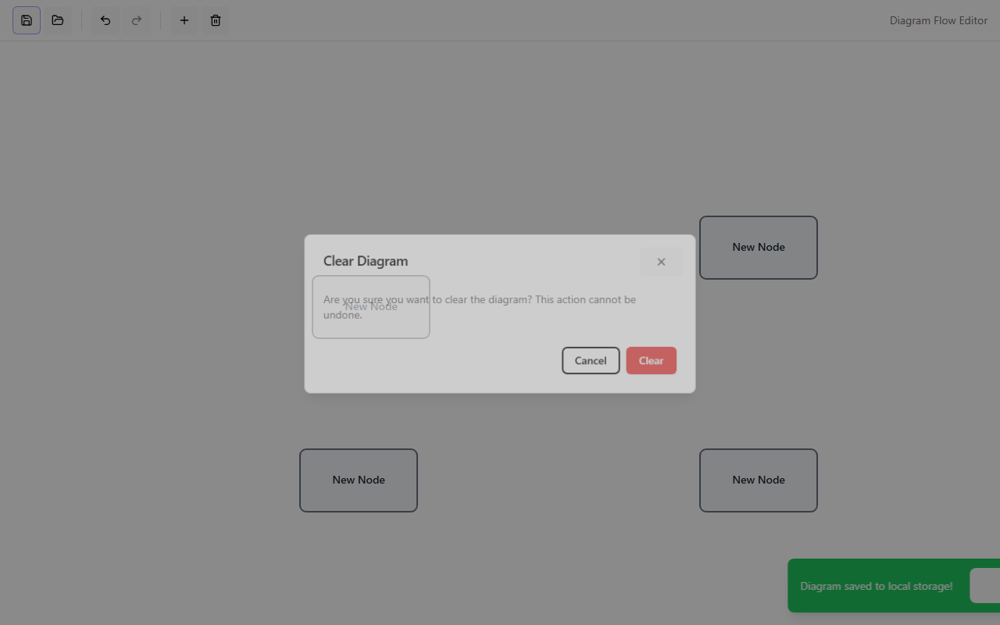

# Diagram Flow Editor

A browser-based diagram editor built with React 19, Zustand, and TanStack Router. Create nodes, connect them with edges, and persist your work to local storage.

## Screenshots

| Empty editor | Nodes on canvas |
|---|---|
|  |  |

| Save toast | Clear confirmation |
|---|---|
|  |  |

> Run `npm run e2e:screenshots` to regenerate these screenshots.

## Features

- **Click to add nodes** — click any empty area on the canvas to place a new node
- **Toolbar add button** — the `+` button adds a node at the default position
- **Drag to move** — drag any node to reposition it
- **Undo / Redo** — full history with the ↩ / ↪ toolbar buttons
- **Save / Load** — persist diagrams to `localStorage`; auto-save runs after every change
- **Clear** — wipe the canvas with a confirmation dialog to prevent accidents
- **Toast notifications** — non-blocking feedback for save/load/clear actions

## Getting Started

```bash
npm install
npm run dev        # start dev server at http://localhost:5173
```

Navigate to `http://localhost:5173/editor` to open the editor.

## Tech Stack

| Layer | Library |
|---|---|
| Framework | React 19 + Vite 7 |
| Routing | TanStack Router |
| State | Zustand 5 |
| UI | shadcn/ui + Radix UI + Tailwind CSS 3 |
| Canvas | SVG (native) |
| Types | TypeScript 5.9 |

## Project Structure

```
src/
├── domain/          # Pure business logic — types and operations (no React)
├── store/           # Zustand store with undo/redo history
├── features/
│   └── diagram/     # DiagramCanvas, Toolbar, NodeDialog
├── components/      # Shared UI (ToastContainer, ConfirmDialog, shadcn/ui)
├── routes/          # TanStack Router pages
├── hooks/           # Custom React hooks
└── lib/             # Constants, localStorage utilities
docs/
├── ARCHITECTURE.md  # Layered architecture design
├── REQUIREMENTS.md  # MVP requirements
├── SPEC.md          # Full specification
└── TASKS.md         # Implementation task breakdown
```

## E2E Tests

Tests use [Playwright](https://playwright.dev/) and run against a live dev server.

```bash
npm run e2e               # run all tests (headless)
npm run e2e:headed        # run with browser visible
npm run e2e:ui            # open Playwright UI explorer
npm run e2e:screenshots   # capture screenshots for docs
npm run e2e:report        # open last HTML report
```

Test files live in `e2e/`:

| File | What it covers |
|---|---|
| `01-editor-load.spec.ts` | Page loads, toolbar visibility, initial disabled state |
| `02-add-node.spec.ts` | Click-to-add, toolbar add, undo, redo |
| `03-clear-diagram.spec.ts` | Clear dialog, confirm, cancel |
| `04-save-load.spec.ts` | Save toast, load toast, persistence across reload |
| `05-drag-node.spec.ts` | Node drag changes position |
| `screenshot-tour.spec.ts` | Full UI tour producing `e2e/screenshots/` for docs |

Screenshots on test failure are saved to `e2e/test-results/`. The HTML report is at `e2e/report/index.html`.
